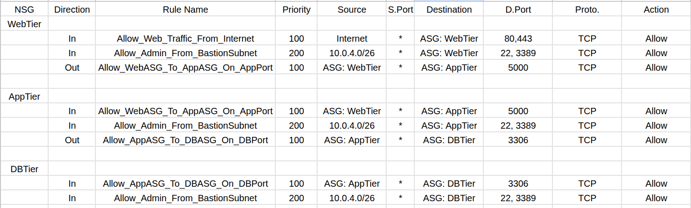

#### 1. Networking Infrastructure

- **Virtual Network: MTWD-VNet**
    - A new VNet for this project provides an isolated network environment in Azure.
    - IP address space: 10.0.00/16
- **Subnets:** The VNet is segmented into the following subnets:
    - **Web-Tier**: 10.0.1.0/24
    - **App-Tier**: 10.0.2.0/24
    - **DB-Tier**: 10.0.3.0/24
    - **AzureBastionSubnet**: 10.0.4.0/26
- **Public IP Addresses:**
    - **Web-VM01-ip**: Used by Web-Server
    - **Bastion-ip**: Used by Bastion for administrative connections
- **DNS:**
    - A custom domain (thedeath.club) is configured with **A** records pointing to the Web Tier's Public IP address, managed via an external DNS provider (GoDaddy in this project).

---

#### 2. Compute Resources (Virtual Machines)

All VMs are deployed using **Ubuntu Server LTS** and **"Standard_B1s"** size for cost-effectiveness.

- **Web-VM01:****
    - Serves web content and acts as a reverse proxy for the application tier API.
    - **Software:** Nginx.
- **App-VM01:****
    - Hosts the backend business logic via REST API.
    - **Software:** Node.js, npm, PM2, Express.js.
- **DB-VM01:****
    - Hosts the MySQL database server.
    - **Software:** MySQL Server.

---

#### 3. Security Components

Security is implemented at multiple layers:

- **Application Security Groups (ASGs):**
    - Each VM's Network Interface Card (NIC) is assigned to a corresponding Application Security Group.
      **(ASG-Web-Tier, ASG-App-Tier, ASG-DB-Tier)**
    - NSG rules reference these ASGs as sources and destinations, simplifying rule management and making them more readable and adaptable than IP-based rules.
- **Network Security Groups (NSGs):**
    - Each subnet has its own dedicated NSG (**NSG-Web-Tier, NSG-App-Tier, NSG-DB-Tier**).
    - NSGs contain specific inbound and outbound rules to strictly control traffic flow.
- **Azure Bastion:**
    - Provides secure SSH access to all VMs via their private IP addresses directly from the Azure portal over HTTPS.
- **Inbound/Outbound Rules:**

  

---

#### 4. Data Flow

- **User Traffic:**
    1. User browses to https://thedeath.club
    2. DNS resolves the domain to the Web Tier's Public IP.
    3. Traffic reaches **Web-VM01** (Nginx).
    4. Nginx serves the HTML/JS frontend.
    5. JavaScript in the browser makes API calls to **Web-VM01** (Nginx).
    6. Nginx (acting as a reverse proxy) forwards these API calls to **App-VM01** on its private IP and API port(5000).
    7. App-VM01 (Node.js API) processes the request, queries DB-VM01 (MySQL) on its private IP and database port(3306).
    8. DB-VM01 returns data to AppVM01.
    9. AppVM01 returns the API response to Web-VM01 (Nginx).
    10. Web-VM01 (Nginx) returns the API response to the user's browser.

---
