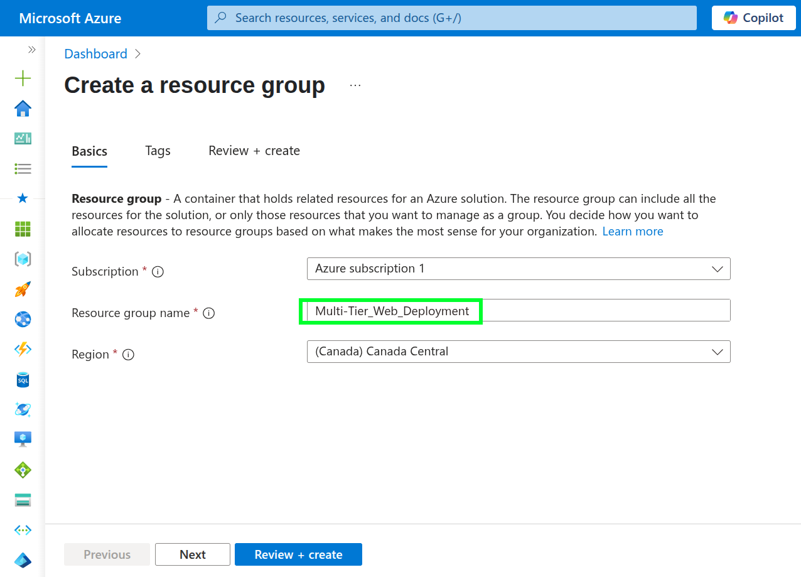
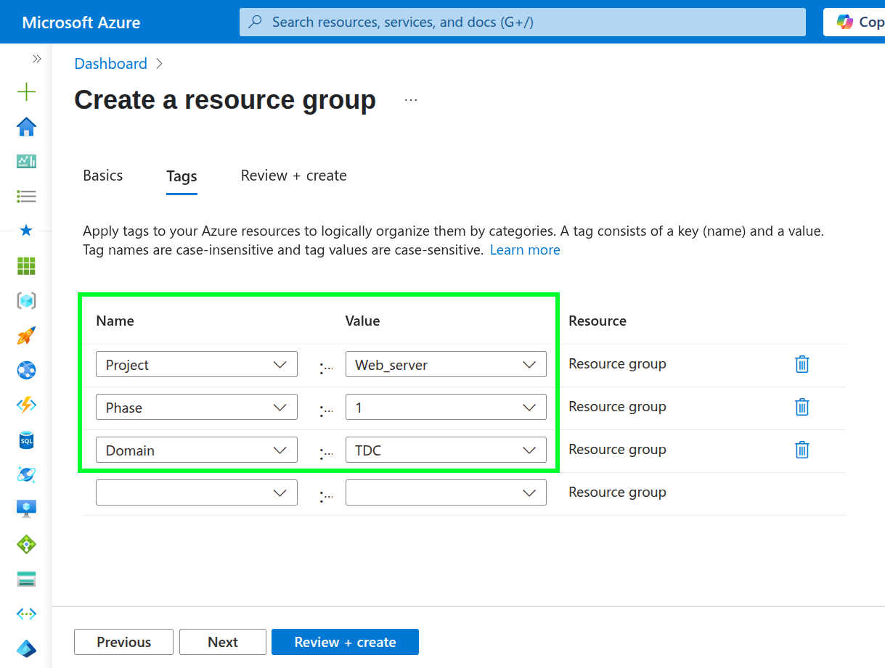
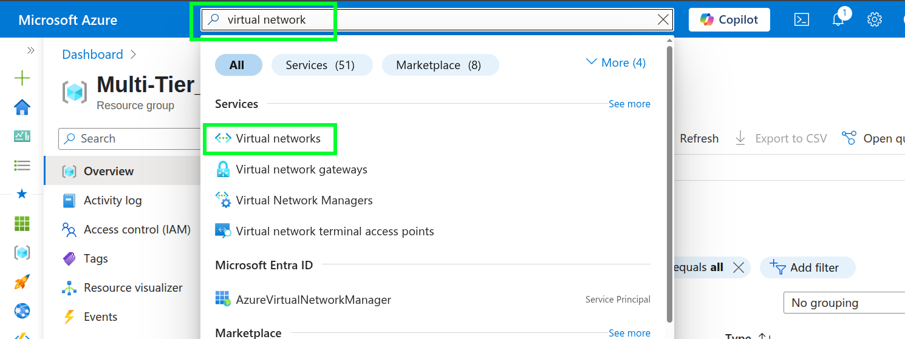
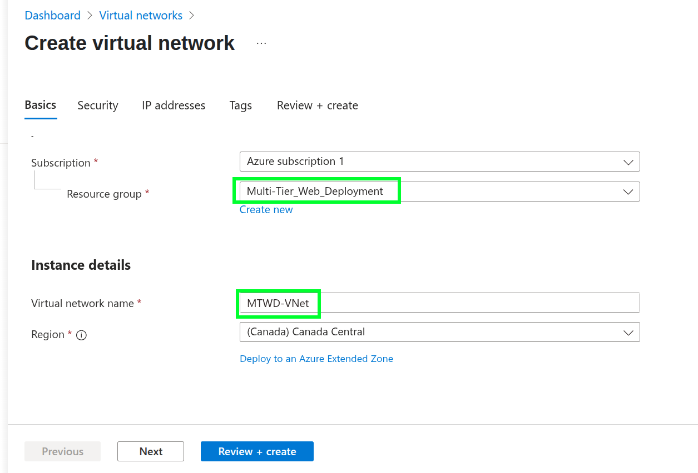
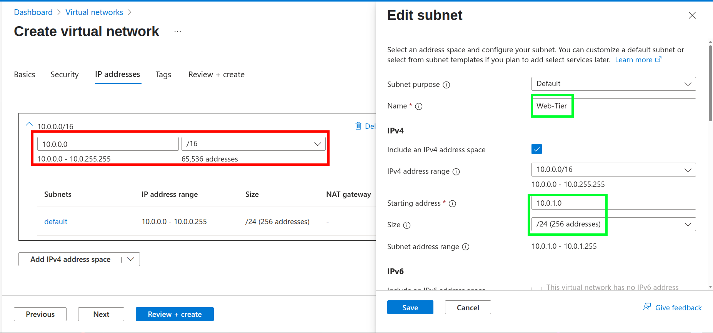
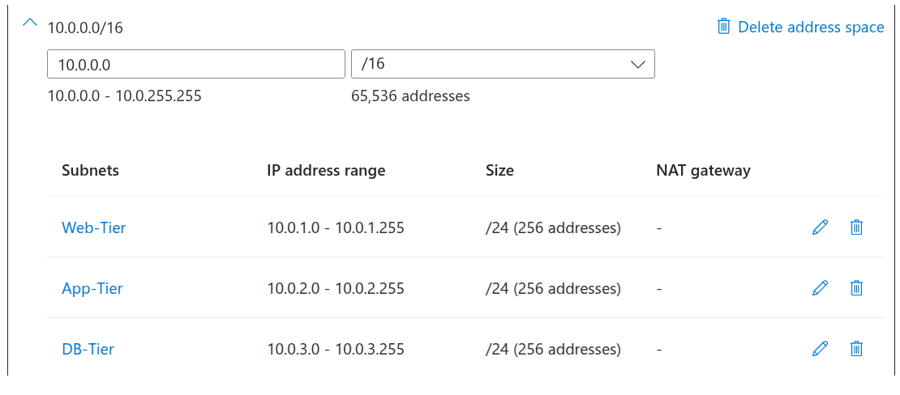
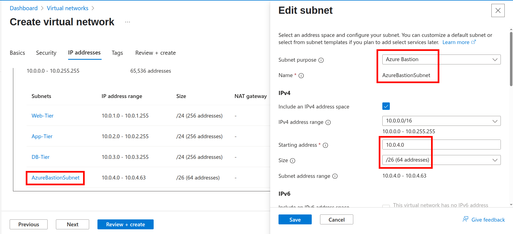
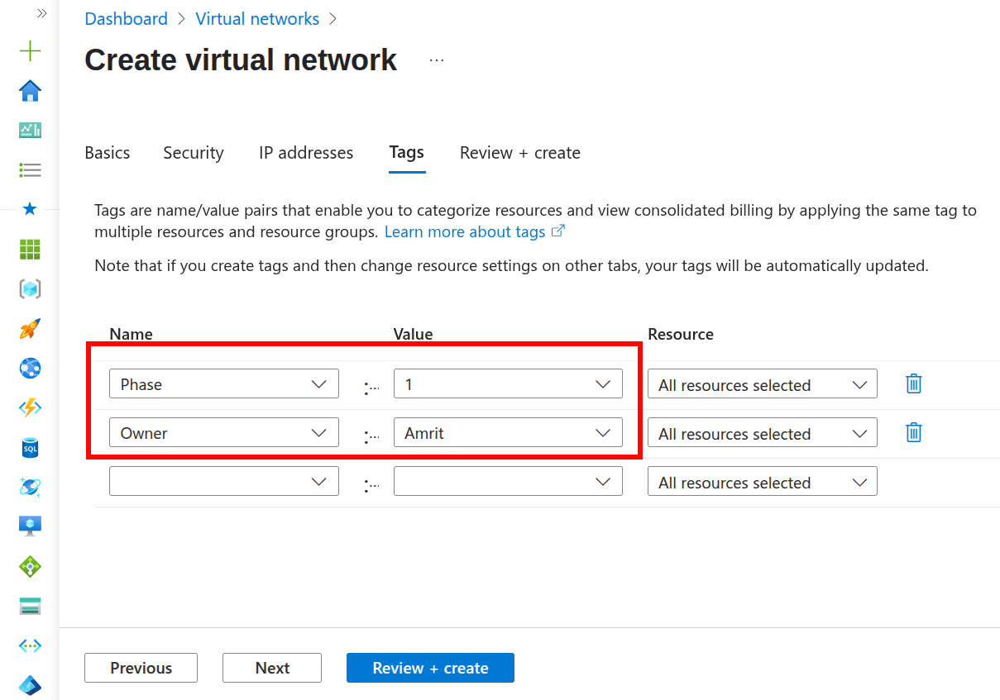
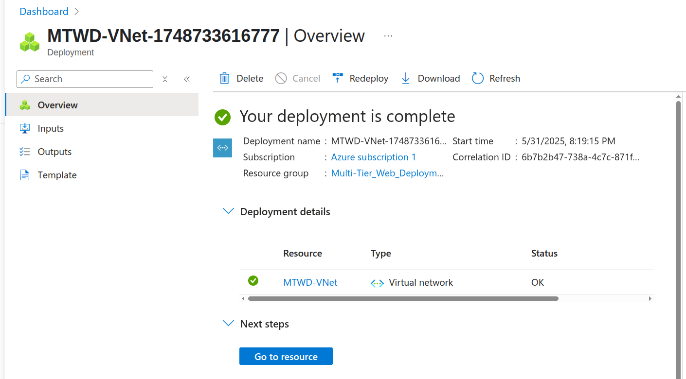

1) We begin with the creation of the Resource group named Multi-Tier_Web_Deployment and to be deployed in Canada Central region(choose whatever region is closest to you to save money).

---

2) We proceed with creating some tags for the resource group for easier management. Create tags which makes sense to you and will be easy to remember if you ever need to apply filters for analysis, monitoring or setting budgets. Tags play a crucial role.

---

3) It's time to set up a virtual network for our resource group, search for "Virtual Networks" in the search bar.

---

4) Give it a name and make sure it's being deployed to the correct subscription and resource group. It's recommeneded to have all the resources in same region to avoid any sort of latency and complexity if they are intended to work together. In our case, we will deploy all resources into the same region which include VMs, Bastion, Vnet, NSGs and more.

---

5) It's better if you create the required subnets while you are still in the same blade. For our project: We have created the following subnets each given a address range.

---

6) For safety precautions and as recommended by Microsoft itself, We should use "Bastion" to connect to the virtual machines in our private network rather than the connection going over the internet. Bastion uses the in-built Microsoft backbone infrastructure for the connection. You can RDP or SSH into a virtual machine using Bastion through the Azure portal, making things way easier. 

---

Only downside to Bastion would be it's high cost. Prolonged use of Bastion can be expensive, so it's recommended to create alerts and set up budgets to be cautious. 

7) Afterwards, apply tags to the VNET as it suits you. Assigning tags in beginning makes your job easy in future, so always take a moment to firstly define them and then keep implementing to each resource.

---

8) Click Review, and wait for the final review where Azure checks if our setting doesn't disobey any policies. Then hit create and the Virutal Network will be deployed.

---

