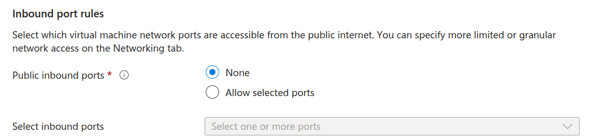

1) Now, it's time to create a Virtual machine for each of the Tier in our Infrastructure. We could create as many VMs we want for each tier depending on traffic but since we are just testing the VMs, we will create only one. So, go ahead and search for virtual machine in the search box.

---

Then give a unique name to your VM, make sure you have selected the subscription and resource group we created earlier.

---

2) Our goal is to save cost so we can select only one availability zone. If you intend to create the web server for high traffic and want redundancy for your VMs, only then I would suggest you to go for better options.

---

3) Pick the Ubuntu Server 24.04 LTS as it would be the most budget-friendly option. Then for size pick the Standard_B1 which will be more than enough for our setup.

---

4) For authentication go for the SSH public key option and give it a name. After creating the VM, the Azure will give you the download option to download the Key into your local machine. Never share that key with anyone, because you are going to use that key to login into your virtual machine. For safety practices, please don't select the password for authetication. If you reading this, then it means you are here to learn, so pick the SSH public key and get familiar with it. And I am glad if you are finding this manual helpful.

---

5) For Inbound port rules, choose None for all of the virtual machines we will create because we will use Network Security Group to define the incoming and outgoing traffic. And this practice will be more clean and consistent, trust me.

---

6) Save money, and choose the standard SSD which is enough for our project.

---

7) Make sure you select the correct subnet based on the VM you are creating. Since we are creating the Web-VM01 where our website will hosted, we need a public IP address. So, select one from here and give it a name. 
   **NOTE:** We just need the public IP for the web-tier because it is facing the internet. We don't need any public IP for the app-tier or DB-tier.
   Since I already told you that we will create NSGs(Network Security Groups) for managaing our traffic, pick None for NIC nsg as shown in the following screenshot.

---

8) Don't forget to add tags, make this a habit which you will understand one day. Then click Create and the Azure will prompt you to download the SSH key we had selected earlier.

---

9) Downlaod the Private SSH key and save it somewhere safe, you will need it once you have to login into the VMs using Bastion.

---

10) Go ahead and take a look inside your resource group, you would notice that the VM we just created, came with 3 dependencies it need to function properly.

---

11) After we are done with Web-VM01, we have to create VMs for the other two tiers. In the following screenshot, I am creating the App-VM01 and most of the configurations will be similar to what we used for Web-VM01.

---

12) Generate a new key for this new VM and store is safely.

---

13) Select the correct subnet for the VM and this VM doesn't need any public IP.

---

14) Just a reminder that no Inbound port rules are needed for any the VMs we are creating because our intention is to use NSG for simplicity and it would be easy to make changes with NSG if we ever need to.

---

15) At this point, you must be comfortable with creating VMs. So now, create the last VM for our Database and be cautious while making configurations.

---

