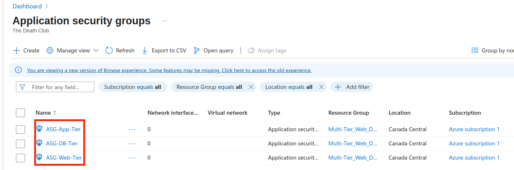
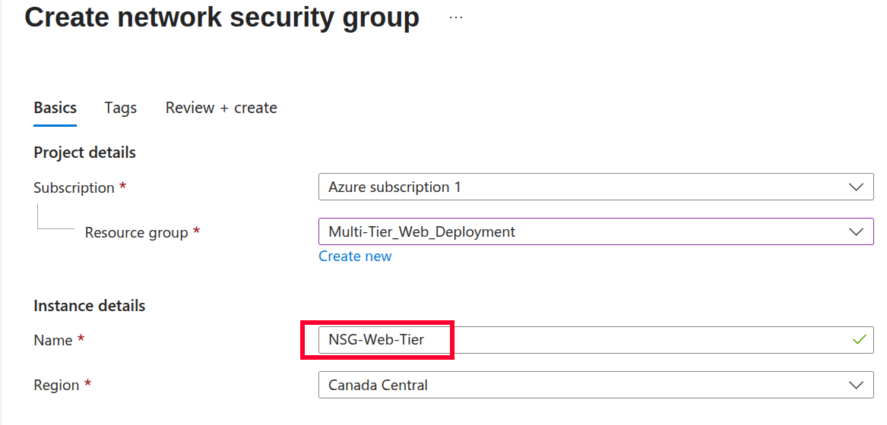

1) Search for ASGs in the search bar and create a new ASG for each of our VM. So give it a name relative to the VM you are creating it for.

---

2) This won't take long since you are just providing name and tags for the ASGs. After you are done creating 3 ASGs, it should look like the following screenshot:

---

3) That's just the half job because these ASGs haven't been assigned to Vms. So, now I want you to open Web-VM01 blade and follow the settings shown in the screenshot to reach the point where you can add a NSG to the NIC(Network Interface Card) of the VM.

---

4) Make sure to select the correct ASG which we designed for it's respective VM. Do this process for all 3 VM.

---

5) Now, I want you to seach for the Network Security Group and press the create new button and then you will reach the following page where you will select the subscription and the resource group of the project you are working on. Firstly, let's create the NSG for our Web-Tier subnet. 
   **NOTE:** In this step, we just gave the NSG a name and it wasn't applied to the subnet yet. We will do that in the future after we create rules for the NSG.

---

6) We need 3 NSGs for our 3 VMs as shown in following screenshot.
   **Note: Remember ASGs are applied to NIC of the VMs, not Subnets!!**
   **Note: NSGs can be applied to both NIC of the VM or the SUBNET, but in this project we are applying the NSG only to the SUBNET.**

---

7) Let's assign or associate each of the NSG to it's respective Subnet. Select one NSG and go to subnets then click associate. In the next tab, select the Virtual Network and subnet. For Web NSG, we selected the Web-Tier Subnet.

---

8) Do the same for the next two NSGs and now we have a well designed foundation before we make inbound/outbound rules in them.

If all of this feels confusing to you, don't worry next section is going to get evem more confusing and complex, haha.

---
