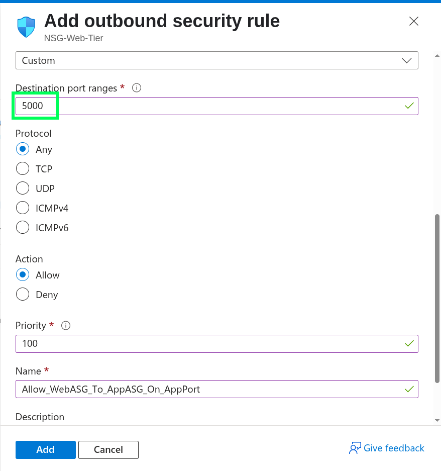

1) Have a look at the following table which defines all the inbound and outbound rules for each of the NSG: Web-Tier, App-Tier and DB-Tier. I want you to spend good amount of time understanding the purpose of the these rules and how they play a role in our Multi-Tier Infrastructure. 

---

2) Firstly, open the NSG-Web-Tier and apply the inbound rules to it. For the first inbound rule, we want to allow traffic from internet into our Web-Tier subnet.

---

3) The ASGs we created are going to help us in this part because instead of defining what IP address range the traffic should go to, we are telling what ASG the traffic should follow. This approach is far better, because you can keep adding devices to the ASG and never worry about remembring the IP address range of the Subnet you need to apply the rules. 

---

4) In the first rule, we are allowing traffic from internet we could be coming from any port number, so source port will be "All Ports." But the destination port on our web VM could only be either 80 or 443 for HTTP and HTTPS traffic respectively. Give it a appropriate name and low priority.

---

5) For our second inbound rule, we are allowing traffic from the Bastion subnet to our Web Vm(or Web ASG). If you remember we didn't define any ASG for the Bastion subnet, so we would have to enter the Source IP address with the CIDR range of the Bastion Subnet. The destination will be the web ASG of our web VM and destination ports will be 22 and 3389(SSH and RDP).

---

6) After defining those two rules, your Inbound rules would look like the following.

---

7) It's time for Outbound rule, and this is for the internal traffic where our Web app will talk to the API in the app-tier. Select the appropriate ASGs as shown in the screenshot.

---

8) We chose the port 5000 as destination port on the NSG App-Tier. Why 5000? Because I chose it randomy here and when we create our APP in the app-tier we will define 5000 as the listening port to get traffic from the Web app VM. You can pick your own port number here within the correct range of port numbers. 

---

9) At this point, you must be comfortable with creating rules. Go check the table I provided in the beginning and define those rules in the NSGs for the App-tier and DB-Tier. For both of these tier, we will also create a inbound rule to allow traffic from Bastion Subnet into the Subnet. For App-tier create a inbound rule to allow traffic from Web-ASG to APP-ASG.

---

10) And the outbound rule so our APP-ASG can commuicate with DB-ASG on the destination port number 3306. I chose 3306 becaue it is considered the default port number for the MySql Database.

---

11) For the NSG-DB-Tier, we need two inbound rules. One for Bastion connection and second one to allow traffic from ASG-App-Tier on port 3306. 

---

12) Now, you might have a question about why we didn't define a outbound rule from ASG-DB-Tier to ASG-App-Tier? The reason lies in stateful nature of NSGs. What that means is their inbound connection from ASG-App-Tier to ASG-DB-Tier will be used to send the return traffic by the database. The return traffic for that _same established connection_ is automatically permitted, even if you have a "Deny All _New_ Outbound" rule. So, no need for setting up any outbound rule for the NSG-DB-Tier.

---
