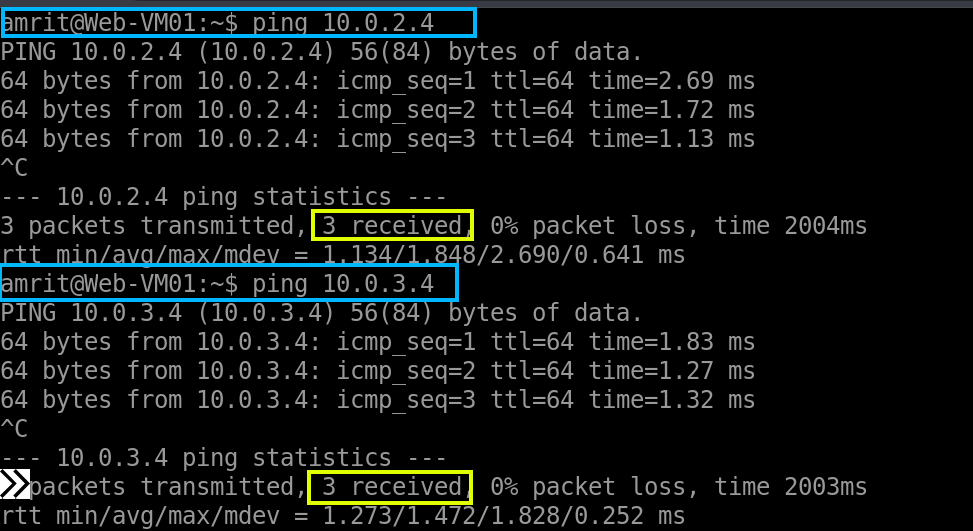

1) Let's use Bastion to log into the VMs. In this example, I will use bastion to log into the Web-VM01 and check connection between other subnets or devices. Firstly, we need to create a Bastion instance, so search for it.

---

2) Select the resource group, and give it a name and then select the Standard tier for our project which should be good. Stick with two instances

---

3) Remember to choose the Bastion-Subnet you created for this specific purpose. Now you might have this question: why does Bastion need a IP address if it's connecting to VMs through the private network? It's because the Public IP on Bastion is for **you to connect to the Bastion _service_**. Once you're "in" the Bastion service, _it_ then uses private networking to connect to your VMs. It's a two-stage process that keeps your VMs themselves off the public internet for management access. 
   Then hit create and give it a few minutes to deploy Bastion.

---

4) Now go into the settings of any of the VM and connect to using Bastion. If you had set up the authentication using the Private SSH key, then upload that key you had downloaded and enter your username.

---

5) A new browser tab will open with you connecting to the linux terminal of the VM. 

---

6) Since we are inside the terminal, let's check the connectivity to the other two VMs which are App-VM01 and DB-VM01 residing in the different subnets with their private ip addresses as shown in the following screenshot. We use the ping command for both of the VMs and the packets were transmitted and received indicating the connections are working perfectly.

---

To disconnect from the VM, just close the browser tab. Or type "exit" into terminal.

7) If you own a custom domain name then, you could point that domain name to public IP of our web APP. So, instead of typing the IP address, users can type the domain name which is easier to remember. So search public IP in the seach bar.

---

8) If you followed the precvious steps correctly, you would see a public IP assigned to Web-VM01. We had given it a public IP while we were setting up the configuration of the VM and we did it only for the Web-VM01 because it is the only VM facing the internet.

---

9) Open the IP blade and from the overview, you could see your public IP address. Copy it. If you had followed the steps correctly, you should have a static IP, make sure it's not a dynamic IP by checking it's properties.

---

10) Now go to your domain registrar from where you had purchased the domain name and add the A record with you public IP address. So, from now on the nameserver at the your domain registrar will point to this IP for any web traffic.

---

11) If I search for my domain name in the search bar of my browser, I am being redirected to the Web-VM01 on the port 443. It's showing this error, because we are not hosting any content on the VM yet. We are doing that in upcoming sections.

---
