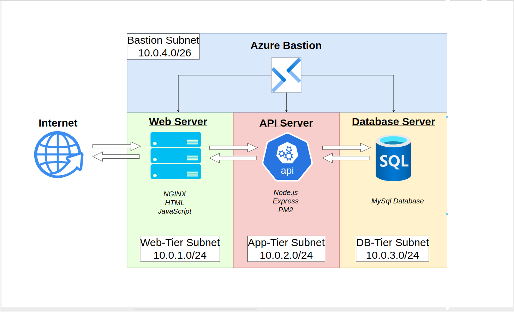

# Azure Multi-Tier Web Deployment
### Overview

This is my personal end-to-end documentation of delpoying a live Website on the Azure infastructure along with APIs and Database. You can follow along this guide and build you own Website or Web-Server, as this documents include screenshots of each step and detailed explanation on how things are working. 

**If you are preparing for AZ-104 or DP-900, I highly recommend you to read it because this project was part of my preperation for AZ-104. It covers various concepts of Azure.**

---
### Architecture

  

---
### Requirements

- Azure Account + Subscription(use $200 free credit)
- Basic Networking concepts: Virtual Networks, Subnets, Private vs Public IPs, Domain-names, TCP, SSH
- Familiarity with Azure concepts: Network Security Groups (NSGs), Application Security Groups (ASGs), Priority, Bastion
- Basic HTML, Javascript and MySql
- IQ over 110 (you also need to put some effort)

---
### Technologies Used

* **Cloud Platform:** Microsoft Azure
* **Infrastructure as Code:** Applied real-world concepts
* **Virtual Machines:** Azure VMs (Ubuntu Server LTS)
* **Networking:** Azure Virtual Network (VNet), Subnets, Network Security Groups (NSGs), Application Security Groups (ASGs)
* **Azure Services:** Azure Bastion, Azure Public IP, Azure DNS
* **Database Tier:** MySQL Server
* **Application Tier:** Node.js, Express.js
* **Web Tier:** Nginx, HTML, CSS, JavaScript
* **Version Control:** Git, GitHub
* **AI:** Google Gemini, ChatGPT (For research and learning)
* **Documentation:** Obsidian, Markdown, Draw.io

---
# Index:
**This project is documented in two main phases, with detailed steps and screenshots.**

### Phase 1: Azure Multi-Tier Infrastructure Setup

The foundational Azure infrastructure was built in this phase. This includes all networking, virtual machines, and core security configurations.

* **1. Resource Group & Virtual Network:** Setting up the initial resource group and configuring the VNet with its subnets, including the AzureBastionSubnet.
    * [View Details](Azure_Multi-Tier_Infrastructure/1-%20Resouce-group%20&%20V-Net.md)
* **2. Setting up Virtual Machines:** Deploying Ubuntu Linux VMs for the Web, App, and DB tiers.
    * [View Details](./Azure_Multi-Tier_Infrastructure/2-%20Setting%20up%20Virtual-Machines.md)
* **3. Creating ASGs and NSGs:** Implementing Application Security Groups for VM grouping and Network Security Groups for defining baseline security.
    * [View Details](./Azure_Multi-Tier_Infrastructure/3-%20Creating%20ASGs%20and%20NSGs.md)
* **4. Inbound & Outbound Rules:** Configuring detailed NSG rules for inter-tier communication, internet access for the web tier, OS updates, and Bastion access, utilizing ASGs.
    * [View Details](./Azure_Multi-Tier_Infrastructure/4-%20Inbound%20&%20Outbound%20Rules.md)
* **5. Bastion and Domain Name:** Setting up Azure Bastion for secure VM access and configuring custom domain DNS records to point to the web server.
    * [View Details](./Azure_Multi-Tier_Infrastructure/5-%20Bastion%20and%20Domain-name.md)

### Phase 2: Web Application Deployment

With the infrastructure in place, a simple 3-tier application was deployed.

* **1. Database (MySQL Setup):** Installing and configuring MySQL on the DB tier VM, creating the application database and user.
    * [View Details](./Web-Deployment/1-%20Database(MySQL%20Setup).md)
* **2. Creating API (Node.js/Express):** Developing and deploying a simple REST API on the App tier VM to interact with the database.
    * [View Details](./Web-Deployment/2-%20Creating%20API.md)
* **3. Web Server (Nginx & Frontend):** Setting up Nginx on the Web tier VM to serve a static HTML/JavaScript frontend and act as a reverse proxy to the App tier API.
    * [View Details](./Web-Deployment/3-%20Web-Server.md)
* **4. Final Testing:** Ensuring the end-to-end application flow works as expected.
    * [View Details](./Web-Deployment/4-%20Final%20Test.md)

---
### Application Code

The simple application code developed for this project can be found here:
* **App Tier (Node.js API):** [`./Web-Deployment/Application_code/app.js`](./Web-Deployment/Application_code/app.js)
* **Web Tier (HTML/JS Frontend):** [`./Web-Deployment/Application_code/index_working.html`](index_working.html.md)

---
### Overall Experience

It was a good experience since I got hands-on practice for the deployment of a Web-Server while intergrating it with the use of API which fetches and writes data to the Database Server. I stumbled upon plently of errors and made mistakes while doing this project and I believe that is exactly where the real learning happens. 

**You always learn from mistakes. Perfection is a fool's dream.**

---
*Thanks for checking it out!*

