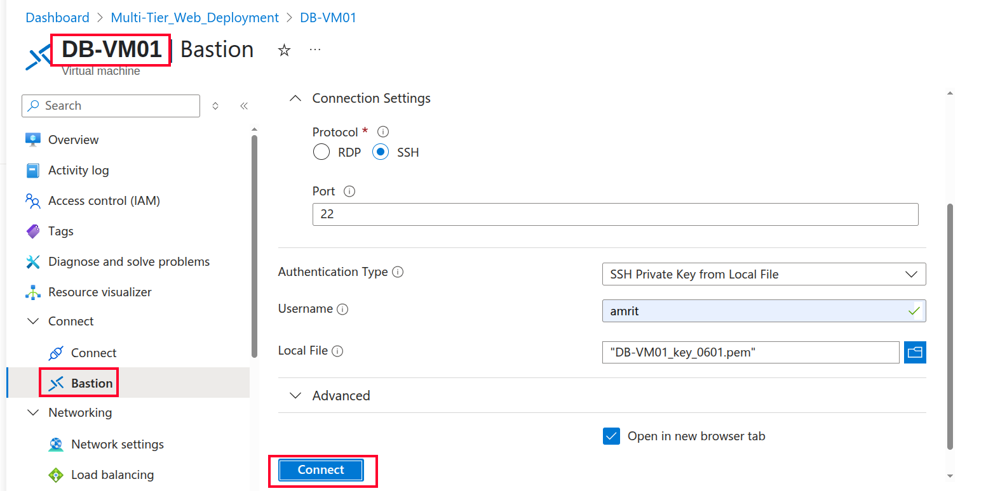
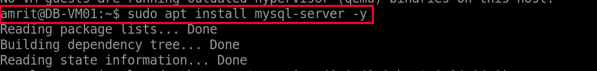
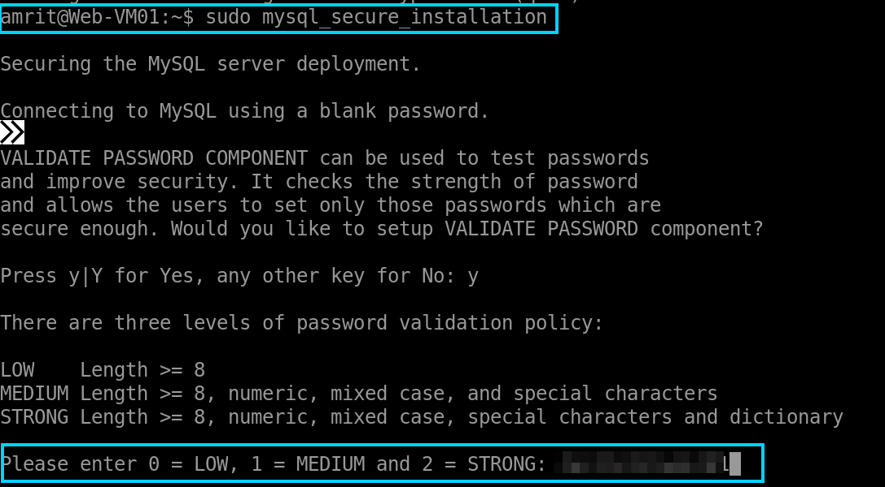
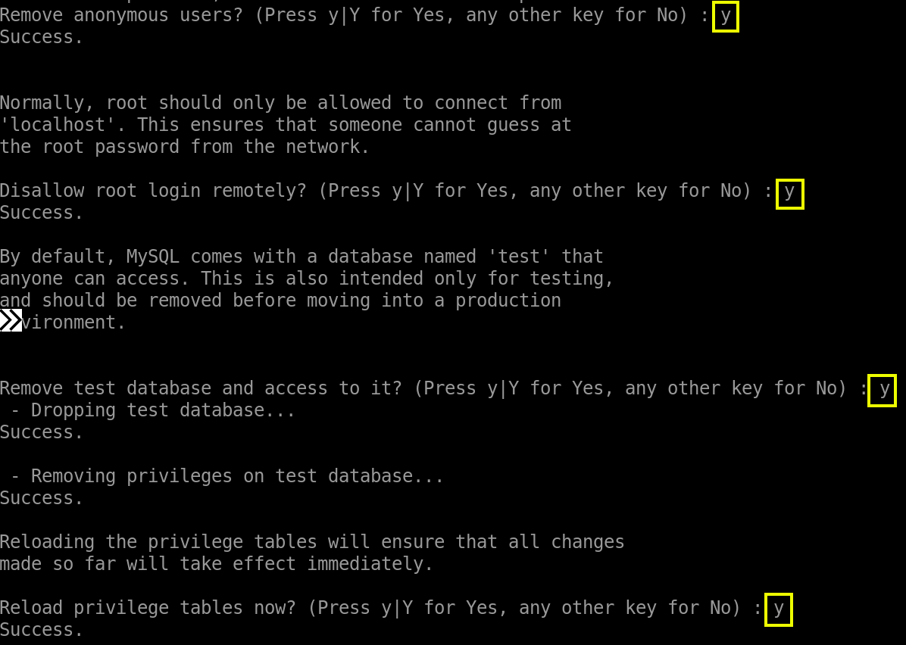
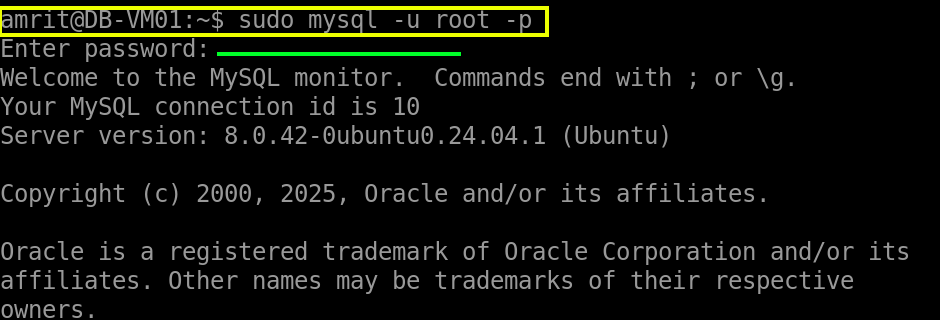
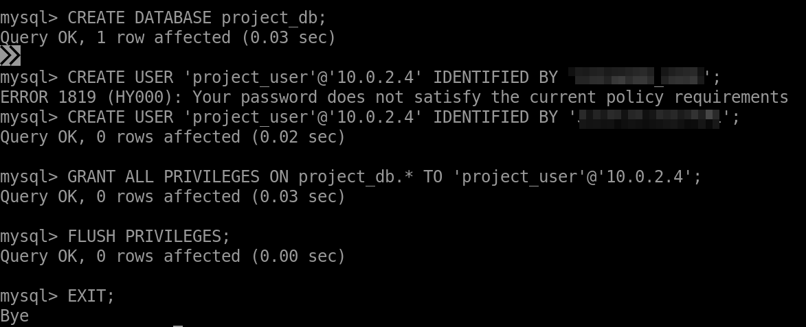
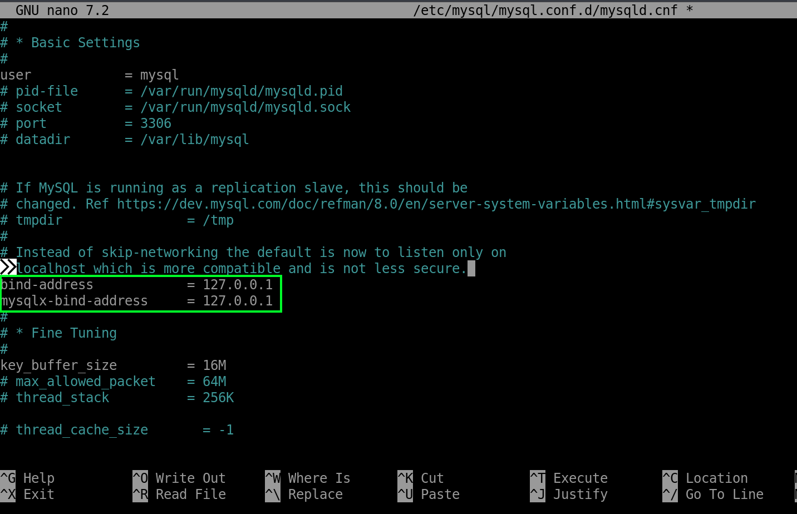
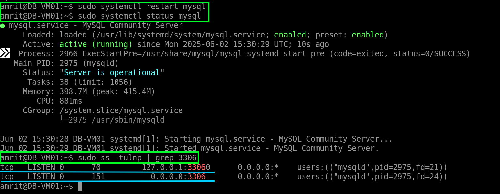

1) Use **Azure Bastion to SSH into `DBVM01`** with your username and SSH private key. 

<p align="center">
  
</p>

---

2) Firstly check for any updates using the follwing command:
   
   ```
   sudo apt update
   ``` 
   
   Then Install the **MySQL server package**:
   
   ```
   sudo apt install mysql-server -y
   ```

<p align="center">
  
</p>

Verify installation and check status (it should be active and running):

```
sudo systemctl status mysql
```

---

3) After installing the MySql sever package, it's important to secure it by setting a root password, removing anonymous users, diasllow remote root login, etc.  
   Use the following command:
   
   ```
   sudo mysql_secure_installation
   ```
   
Press Y, for setting up the password and choose a strong one. This password will be use once you have to login inside the MySql server.

<p align="center">
  
</p>

Then you will be asked a series of question, take you time and read them carefully. Select the following options as shown in the screenshot for the best security practices.

<p align="center">
  
</p>

---

4) Log into the MySQL command line as the root user and use the password you had set in the previous step:
   
   ```
   sudo mysql -u root -p
   ```

<p align="center">
  
</p>

We need a database for our Web-app and it's time to create since we are now inside the MySQL server. Using the following command to create the database and give it a name:

```
CREATE DATABASE project_db;
```

For this database, we now create a user for the App-VM01, so the app can connect to the database server using this username and password. Use the private IP address in the commnad to only allow user login from that specific IP address.

```
CREATE USER 'project_user'@'10.0.2.4' IDENTIFIED BY 'PASSWORD_HERE';
```

<p align="center">
  
</p>

Grant privileges to this new user on your database:

```
GRANT ALL PRIVILEGES ON project_db.* TO 'project_user'@'10.0.2.4';
```

Apply the changes:

```
FLUSH PRIVILEGES;
```

Exit the MySQL:

```
EXIT;
```

---

5. Configure MySQL to Listen for Remote Connections:
   
By default, MySQL often only listens on `127.0.0.1` (localhost). You need it to listen on an IP address that `App-VM01` can reach. `0.0.0.0` means it will listen on all available network interfaces on `DBVM01`.

Edit the MySQL configuration file. The main file is often `mysqld.cnf`.

```
sudo nano /etc/mysql/mysql.conf.d/mysqld.cnf
```

Change the bind-address to the following:
 
```
bind-address = 0.0.0.0
```

<p align="center">
  
</p>

Save the file and exit `nano` (Ctrl+X, then Y, then Enter)

You might have noticed the following:  
`mysqlx_bind_address = 127.0.0.1`

- This relates to the **MySQL X Protocol** (also known as X DevAPI). It's a newer protocol that allows for both SQL and NoSQL-style document store access, often running on a different port (like 33060).

- Leaving `mysqlx_bind_address` as `127.0.0.1` means the X Protocol service (if it's running) will only be accessible locally on the `DBVM01` itself. This is more secure if we are not planning to use it, as it doesn't expose an extra service to your VNet.

So, let's focus on changing the main `bind-address` to `0.0.0.0`. You can leave `mysqlx_bind_address` as `127.0.0.1`.

---

6. Restart MySQL Service to save the changes:
   
```
sudo systemctl restart mysql
```

---

7. Verify MySQL is Listening Correctly:
   
```
sudo systemctl status mysql
``` 
 
Check network sockets to confirm MySQL is listening on `0.0.0.0:3306` 

```
sudo ss -tulnp | grep 3306
```

You should see a line indicating `mysqld` is listening on a port that includes `0.0.0.0` or `*` and port `3306`.

<p align="center">
  
</p>

---

That's it for setting up the database server itself on DB-VM01. Your NSG rule on DBTier-NSG (allowing inbound on port 3306 from ASG-AppTier) will handle allowing the network traffic once your App Tier tries to connect.

