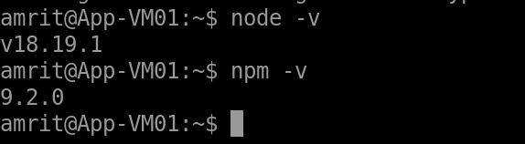
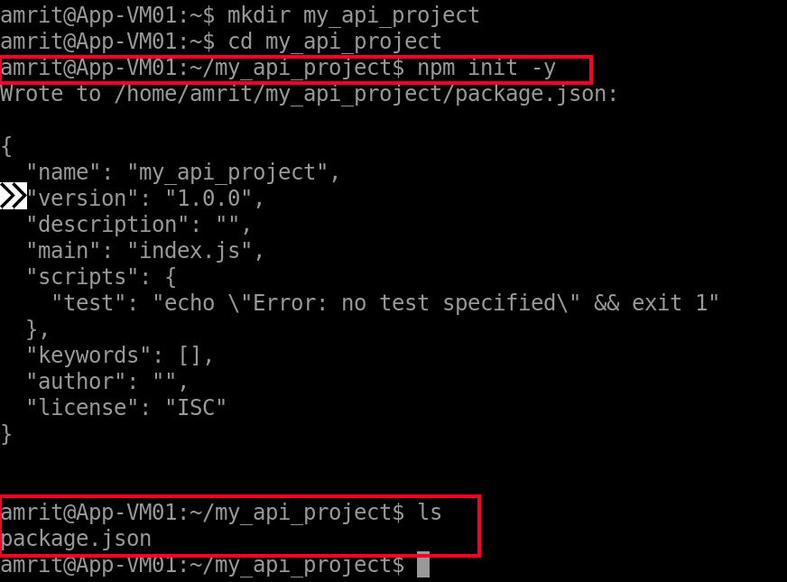

1) **Connect to `App-VM01`:**

Use Azure Bastion to SSH into `AppVM01` with your username and SSH private key.

<p align="center">
  
</p>

---

2) **Install Node.js and npm (Node Package Manager):**
 
Update package lists:

```
sudo apt update
```

Install Node.js and npm:

```
sudo apt install nodejs npm -y
```

<p align="center">
  
</p>

Check versions:

```
node -v
npm -v
```

<p align="center">
  
</p>

---

3) **Set Up Your Project Directory & Initialize:** 

```
mkdir my_api_project
cd my_api_project
npm init -y
```

<p align="center">
  
</p>

---

4) **Install Necessary npm Packages:**

```
npm install express mysql2
```

<p align="center">
  
</p>

---

5) **Create Your API Code File (app.js):**

```
nano app.js
```

Paste the following code:

```js
const express = require('express');
const mysql = require('mysql2/promise');
const app = express();
app.use(express.json());

const dbConfig = {
    host: '[10.0.3.4]',
    user: 'project_user',
    password: 'YOUR_PASSWORD',
    database: 'project_db'
};

app.post('/items', async (req, res) => {
    const { message } = req.body;
    if (!message) {
        return res.status(400).send({ error: 'Message content is required in the request body' });
    }

    let connection;
    try {
        connection = await mysql.createConnection(dbConfig);
        const [result] = await connection.execute('INSERT INTO messages (content) VALUES (?)', [message]);
        console.log(`Inserted item with ID: ${result.insertId}`);
        res.status(201).send({ id: result.insertId, message: message });
    } catch (err) {
        console.error('Error adding item to database:', err);
        res.status(500).send({ error: 'Failed to add item to database. Check API server logs.' });
    } finally {
        if (connection) await connection.end();
    }
});

app.get('/items', async (req, res) => {
    let connection;
    try {
        connection = await mysql.createConnection(dbConfig);
        const [rows] = await connection.execute('SELECT id, content, created_at FROM messages ORDER BY id DESC');
        res.send(rows);
    } catch (err) {
        console.error('Error fetching items from database:', err);
        res.status(500).send({ error: 'Failed to fetch items from database. Check API server logs.' });
    } finally {
        if (connection) await connection.end();
    }
});

const PORT = 5000;
app.listen(PORT, '0.0.0.0', () => {
    console.log(`API server listening on port ${PORT}`);
});
```

<p align="center">
  
</p>

---

6) **Ensure messages Table Exists in MySQL on DBVM01:**

SSH into DBVM01 via Bastion.

<p align="center">
  
</p>

Create table:

```
sudo mysql -u root -p
USE project_db;
CREATE TABLE IF NOT EXISTS messages (
    id INT AUTO_INCREMENT PRIMARY KEY,
    content TEXT NOT NULL,
    created_at TIMESTAMP DEFAULT CURRENT_TIMESTAMP
);
SHOW TABLES;
DESCRIBE messages;
EXIT;
```

<p align="center">
  
</p>

<p align="center">
  
</p>

---

7) **Run & Test Your API Locally on AppVM01:**

```
node app.js
```

<p align="center">
  
</p>

In another SSH terminal:

```
curl -X POST -H "Content-Type: application/json" -d '{"message":"First message from API!"}' http://localhost:5000/items
curl http://localhost:5000/items
```

<p align="center">
  
</p>

<p align="center">
  
</p>

---

8) **Make Your API Run Persistently (using PM2):**

Install PM2 and start the app:

```
sudo npm install pm2 -g
pm2 start app.js --name my-api
pm2 list
pm2 logs my-api
pm2 startup
```

<p align="center">
  
</p>

<p align="center">
  
</p>

<p align="center">
  
</p>

Run the startup command PM2 outputs, then:

```
pm2 save
```

---

