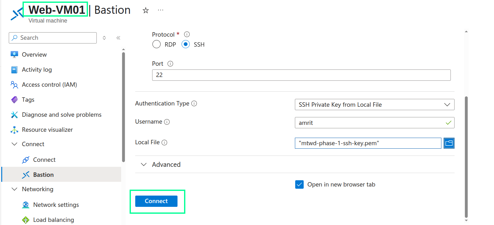
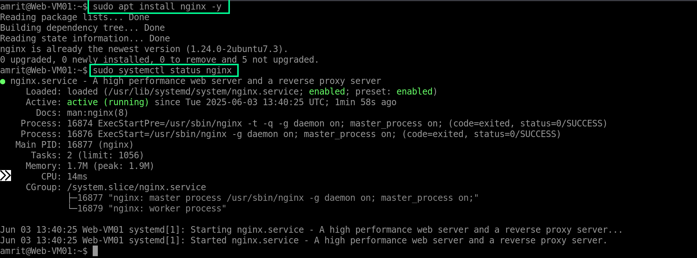
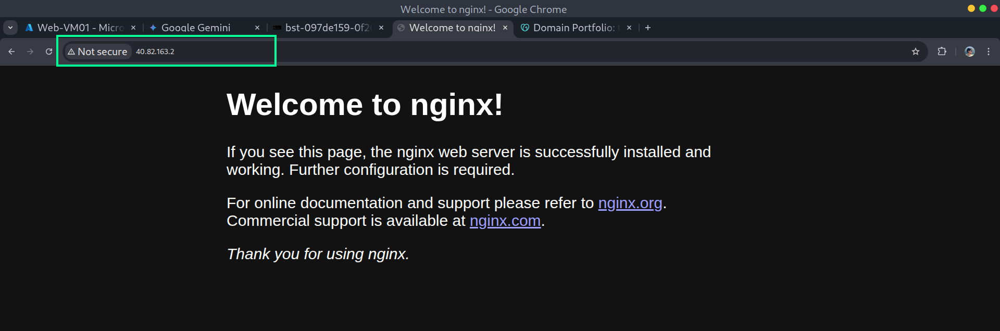
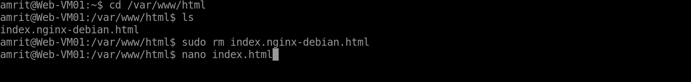
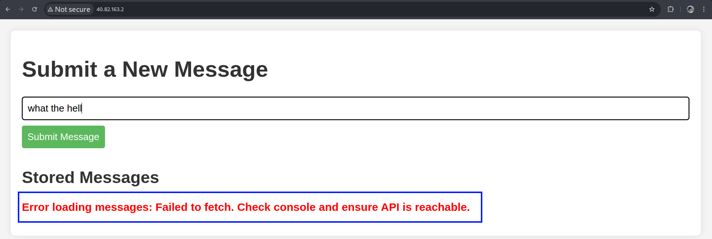
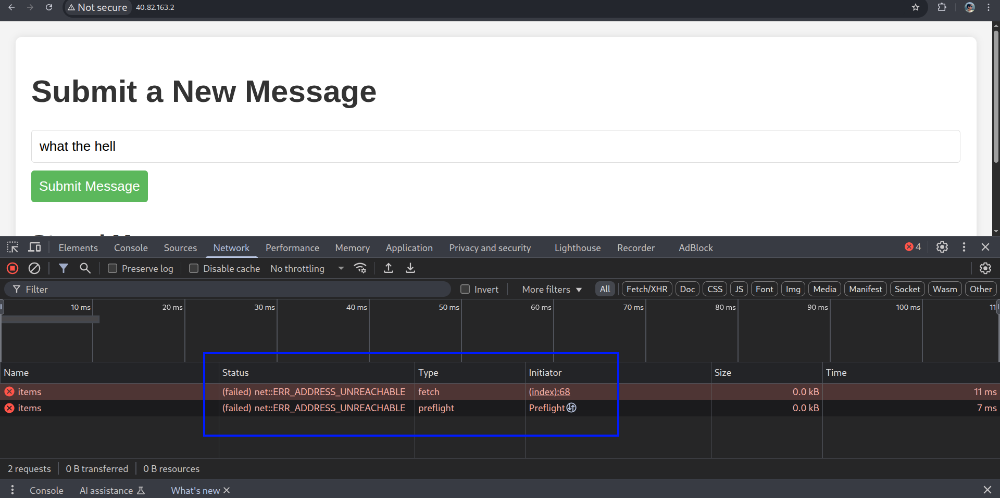
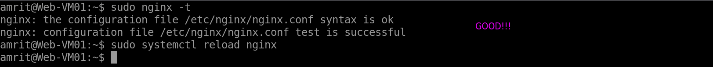
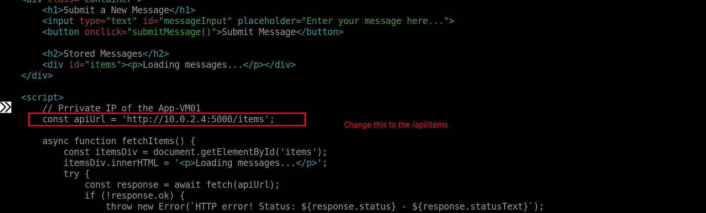
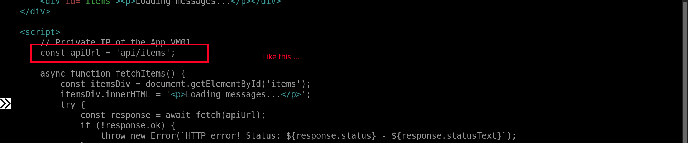

**Web Tier Front-End (WebVM01) - Nginx + HTML/JavaScript**

**Objective:** Install the Nginx web server, create a simple HTML page with JavaScript that allows users to submit messages and view messages by calling your App Tier API.

1) **Connect to WebVM01:Use Azure Bastion to SSH into WebVM01.**



```
sudo apt update
sudo apt install nginx -y
sudo systemctl status nginx
```



It should show "active (running)". 

---

2) **Initial Test:** 

Open a web browser on your local computer and navigate to the Public IP of you Web-VM01.



You should see the default "Welcome to nginx!" page. This confirms Nginx is working and accessible from the internet. Remember, we had made a NSG rule where we allowed traffic from the internet.

---

3) **Creating a custom website:**

Now, it's time to add content to our website and for that we will create a new index.html file.

```
cd /var/www/html
sudo rm index.nginx-debian.html 
sudo nano index.html
```



Paste the following HTML and JavaScript code into index.html.

```
<!DOCTYPE html>
<html lang="en">
<head>
    <meta charset="UTF-8">
    <meta name="viewport" content="width=device-width, initial-scale=1.0">
    <title>Project The Death Club</title>
    <style>
        body { font-family: Arial, sans-serif; margin: 20px; background-color: #f4f4f4; color: #333; }
        .container { background-color: #fff; padding: 20px; border-radius: 8px; box-shadow: 0 0 10px rgba(0,0,0,0.1); }
        h1, h2 { color: #333; }
        input[type="text"], button { padding: 10px; margin-bottom: 10px; border-radius: 4px; border: 1px solid #ddd; }
        input[type="text"] { width: calc(100% - 22px); }
        button { background-color: #5cb85c; color: white; cursor: pointer; border: none; }
        button:hover { background-color: #4cae4c; }
        #items div { background-color: #e9e9e9; padding: 10px; margin-bottom: 8px; border-radius: 4px; }
        .error { color: red; font-weight: bold; }
    </style>
</head>
<body>
    <div class="container">
        <h1>Submit a New Message</h1>
        <input type="text" id="messageInput" placeholder="Enter your message here...">
        <button onclick="submitMessage()">Submit Message</button>

        <h2>Stored Messages</h2>
        <div id="items"><p>Loading messages...</p></div>
    </div>

    <script>
        // Prrivate IP of the App-VM
        const apiUrl = 'http://10.0.2.4:5000/items'; 

        async function fetchItems() {
            const itemsDiv = document.getElementById('items');
            itemsDiv.innerHTML = '<p>Loading messages...</p>';
            try {
                const response = await fetch(apiUrl);
                if (!response.ok) {
                    throw new Error(`HTTP error! Status: ${response.status} - ${response.statusText}`);
                }
                const items = await response.json();
                itemsDiv.innerHTML = ''; // Clear loading message
                if (items.length === 0) {
                    itemsDiv.innerHTML = '<p>No messages yet. Be the first!</p>';
                } else {
                    items.forEach(item => {
                        const div = document.createElement('div');
                        div.textContent = `ID: ${item.id} | Message: ${item.content} (Added: ${new Date(item.created_at).toLocaleString()})`;
                        itemsDiv.appendChild(div);
                    });
                }
            } catch (error) {
                console.error('Error fetching items:', error);
                itemsDiv.innerHTML = `<p class="error">Error loading messages: ${error.message}. Check console and ensure API is reachable.</p>`;
            }
        }

        async function submitMessage() {
            const messageInput = document.getElementById('messageInput');
            const message = messageInput.value.trim();

            if (!message) {
                alert('Please enter a message.');
                return;
            }

            try {
                const response = await fetch(apiUrl, {
                    method: 'POST',
                    headers: { 'Content-Type': 'application/json' },
                    body: JSON.stringify({ message: message })
                });

                if (!response.ok) {
                    const errorData = await response.json().catch(() => ({ detail: response.statusText })); // Try to get JSON error, fallback to statusText
                    throw new Error(`HTTP error! Status: ${response.status} - ${errorData.error || errorData.detail}`);
                }

                // const newItem = await response.json(); // Not strictly needed if just confirming success
                console.log('Message submitted successfully');
                messageInput.value = ''; // Clear input field
                fetchItems(); // Refresh the list of items
            } catch (error) {
                console.error('Error submitting message:', error);
                alert(`Failed to submit message: ${error.message}`);
            }
        }

        // Initial load of items when the page is ready
        document.addEventListener('DOMContentLoaded', fetchItems);
    </script>
</body>
</html>
```

**IMPORTANT:** Replace 'http://10.0.2.4:5000/items' with the actual private IP address of your App-VM01 and the port number you had set up for the API.

4) **Test Your Full Web Application:**

Open your web browser on your local computer and search for the public IP of your web server. You should see your "Submit a New Message" page.



As you can see I got an error, you will get the same error if you had followed all the previous steps. This is because we missed one important detail on how the web servers work by default.

Before fixing this error, we need to understand it. Open the developer setting in your browser and click on Network tab to find the reason of this error.



It says that it failed to reach an address and if you check the line in html code where the error is, you will find that our browser failed to connect to the API we installed in the App-VM01. Because it is residing the private network with address of 10.0.2.4 and it can't be accessed by the user on the internet.

So, we have a flaw in our HTML code plus we need to tell our Web-VM01 to act as **Reverse PROXY** to send the request to the App-VM01.

5) **The Solution: Reverse Proxy with Nginx on Web-VM01:**

To fix this, your browser needs to send API requests to a publicly accessible address (your Web-VM01's public IP / domain name). Then, Nginx on Web-VM01 will act as a "middleman" (a reverse proxy) and forward those requests to your App-VM01 over the private network.

Firstly, SSH into Web-VM01 via Bastion.


Then, Edit the Nginx default site configuration file:

```
sudo nano /etc/nginx/sites-available/default
```

Inside the `server { ... }` block, you need to add a `location` block that will handle requests to a specific path (i.e., /api/) and proxy them to your App Tier. 
Add the following code snippet inside the existing `server { }` block, for example, before the `location / { ... }` block for your main index.html:

```
location /api/ {
        proxy_pass http://10.0.2.4:5000/; # Forward to your App Tier API
        proxy_set_header Host $host;
        proxy_set_header X-Real-IP $remote_addr;
        proxy_set_header X-Forwarded-For $proxy_add_x_forwarded_for;
        proxy_set_header X-Forwarded-Proto $scheme;
    }
```

Make sure to change the Private IP and port number of the App-VM01.


Save the file and exit nano. Then test you Nginx conigurations:

```
sudo nginx -t
sudo systemctl reload nginx
```



It should say the syntax is okay and the test is successful. At last, restart the Nginx server.

6) **Modify Your JavaScript `apiUrl` in `index.html` on `WebVM01`:**

Edit your `index.html` file again:

```
sudo nano /var/www/html/index.html
```
  


Change the `apiUrl` to point to the new proxied path on your _web server_:

```
const apiUrl = '/api/items';
```

This is a relative path, it means http://your.thedeath.club/api/items.. So instead of connecting to the App-VM01 directly, it sends the request to the Nginx server and the Nginx server will accept it because we had added the location /api/ {.....} code snippet in the previous step. Nginx will catch requests to `/api/` and forward them to your App Tier.



