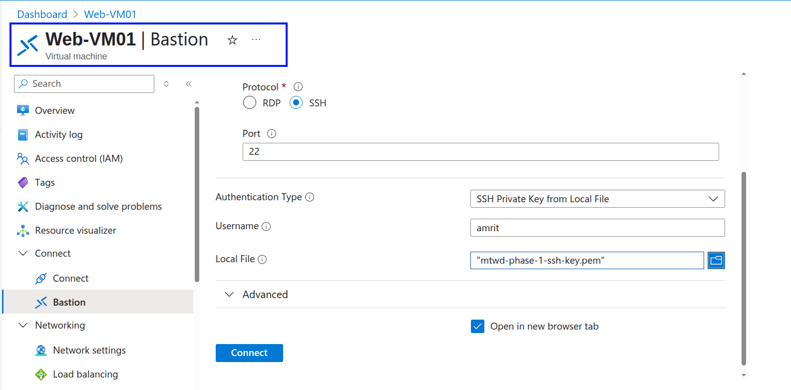
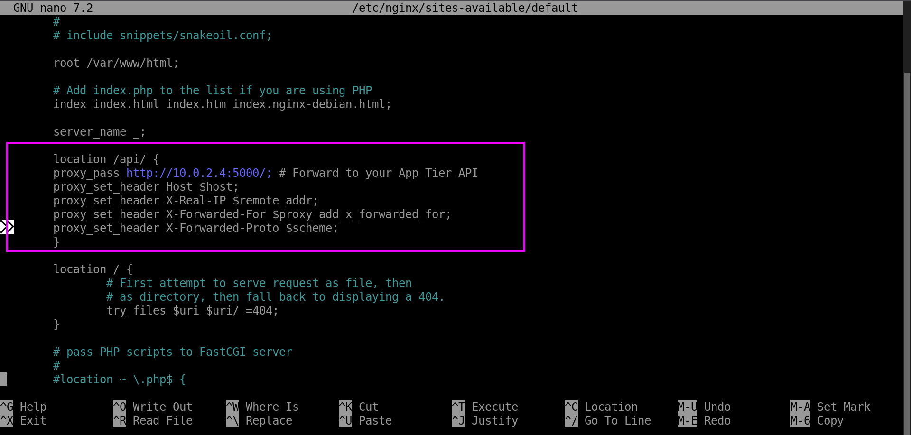

**Web Tier Front-End (WebVM01) - Nginx + HTML/JavaScript**

**Objective:** Install the Nginx web server, create a simple HTML page with JavaScript that allows users to submit messages and view messages by calling your App Tier API.

1) **Connect to WebVM01: Use Azure Bastion to SSH into WebVM01.**

<p align="center">
  
</p>

```
sudo apt update
sudo apt install nginx -y
sudo systemctl status nginx
```

<p align="center">
  
</p>

---

2) **Initial Test:**

Open a web browser on your local computer and navigate to the Public IP of you Web-VM01.

<p align="center">
  
</p>

---

3) **Creating a custom website:**

```
cd /var/www/html
sudo rm index.nginx-debian.html 
sudo nano index.html
```

<p align="center">
  
</p>

Paste the HTML/JavaScript code you provided above.  
**IMPORTANT:** Replace `'http://10.0.2.4:5000/items'` with the private IP of your App-VM01.

---

4) **Test Your Full Web Application:**

Open your browser and access the public IP of WebVM01.

<p align="center">
  
</p>

Open DevTools → Network tab to debug.

<p align="center">
  
</p>

---

5) **The Solution: Reverse Proxy with Nginx on Web-VM01:**

SSH into Web-VM01 via Bastion.

<p align="center">
  
</p>

Edit the Nginx default config:

```
sudo nano /etc/nginx/sites-available/default
```

Add this inside the `server {}` block:

```
location /api/ {
        proxy_pass http://10.0.2.4:5000/;
        proxy_set_header Host $host;
        proxy_set_header X-Real-IP $remote_addr;
        proxy_set_header X-Forwarded-For $proxy_add_x_forwarded_for;
        proxy_set_header X-Forwarded-Proto $scheme;
    }
```

<p align="center">
  
</p>

Then test and reload Nginx:

```
sudo nginx -t
sudo systemctl reload nginx
```

<p align="center">
  
</p>

---

6) **Modify Your JavaScript `apiUrl` in `index.html` on `WebVM01`:**

```
sudo nano /var/www/html/index.html
```

<p align="center">
  
</p>

Update the line:

```
const apiUrl = '/api/items';
```

<p align="center">
  
</p>

This completes the setup for reverse proxy and browser-accessible API connection.

