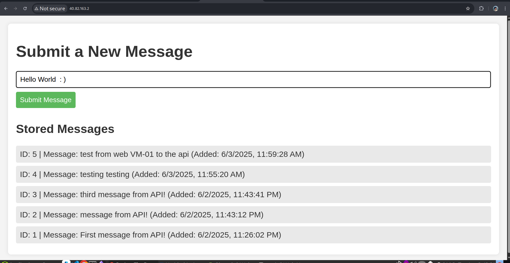
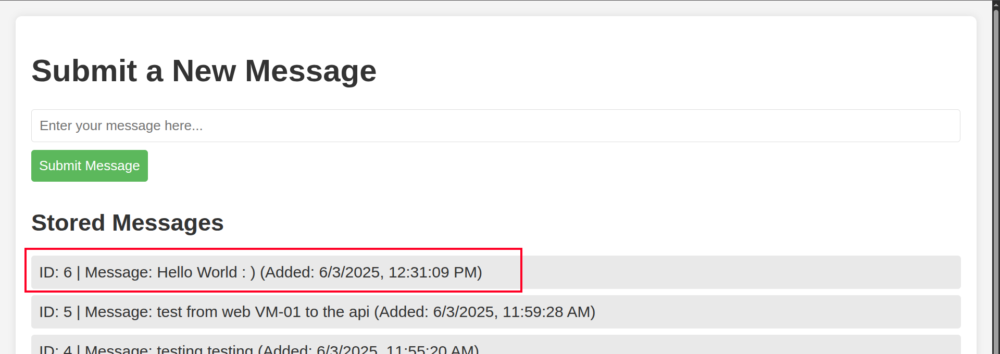

1) **Test Again in Your Browser:**

The error has finally vanished and you could see the history of the items we had previously added while we were still in the SSH session of App-VM01. 
Go ahead, and submit a new message.

The message was sent and it was retrieved immediately by the web server and you can also see the ID of the message we had sent.

---

2) **Search by domain-name:**

Like me, if you had set up your own domain-name for your website, then you will able to reach it by typing in your domain-name.

Make your added the A record to point to the Public IP of your Web-VM01 in the DNS records of you domain registrar.

---
