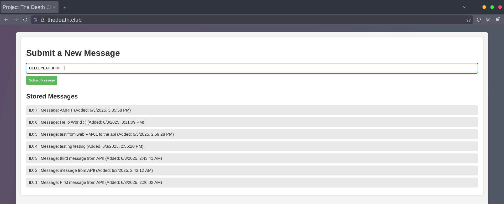

1) **Test Again in Your Browser:**

The error has finally vanished and you could see the history of the items we had previously added while we were still in the SSH session of App-VM01.  
Go ahead, and submit a new message.

<p align="center">
  
</p>

The message was sent and it was retrieved immediately by the web server and you can also see the ID of the message we had sent.

<p align="center">
  
</p>

---

2) **Search by domain-name:**

Like me, if you had set up your own domain-name for your website, then you will able to reach it by typing in your domain-name.

Make sure you added the A record to point to the Public IP of your Web-VM01 in the DNS records of your domain registrar.

<p align="center">
  
</p>

---

3) **Installing Certificate for HTTPS:**

This is must if you want to make you website accessible to user because it provide encryption and some browsers might block the HTTP traffic or won't load the contents of the website.
Installing certficates is straight-forward, you firsly need to install **CERTBOT**:

```
sudo apt install certbot python3-certbot-nginx -y
```

<p align="center">
  
</p>

After this, input your primary and secondary domain-name in order:

```
sudo certbot --nginx -d thedeath.club -d www.thedeath.club
```
<p align="center">
  
</p>

---

4) Now, open up your browser and check again:

Press on the "info" icon, to learn more about the connection the browser has set up with the web server. In our example. it's saying that the connection is now secure.

<p align="center">
  
</p>

---
